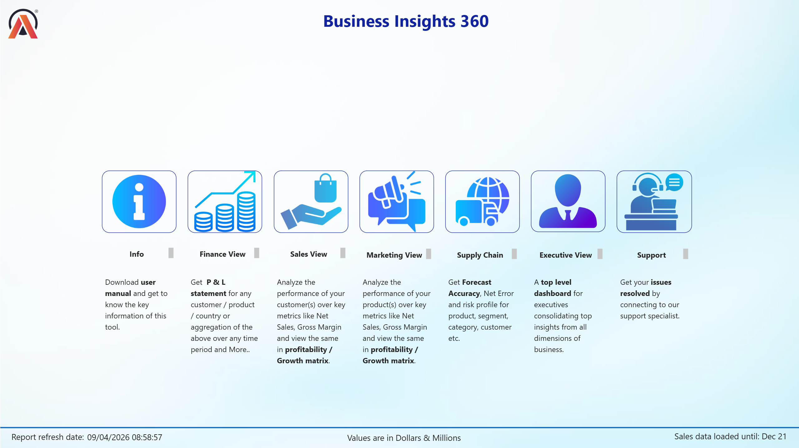

# Project-360

## 📊 Interactive Power BI Dashboard

  <strong>👆 Click the dashboard to explore the interactive report</strong>

  <a href="https://app.powerbi.com/view?r=eyJrIjoiYjhmNTFmYzMtZDc5NC00MTc4LWI5MTMtMzI3MjNmMTJmOTI0IiwidCI6ImM2ZTU0OWIzLTVmNDUtNDAzMi1hYWU5LWQ0MjQ0ZGM1YjJjNCJ9">
    🔗 Open Power BI Dashboard
  </a>

### 📌 About the Dashboard

This interactive Power BI dashboard provides a 360° view of the business, combining key performance indicators, trends, and detailed analysis into a single reporting experience.

### 🛠️ Tools & Technologies

- Power BI
- DAX
- Power Query
- Data Modelling
- Data Visualization
